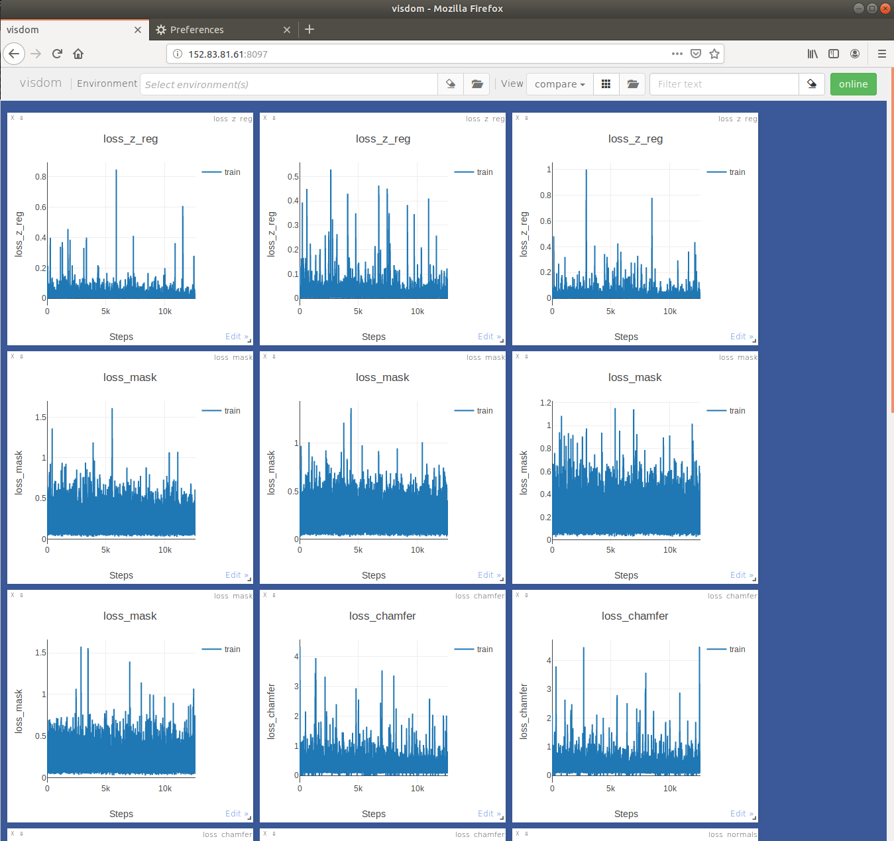
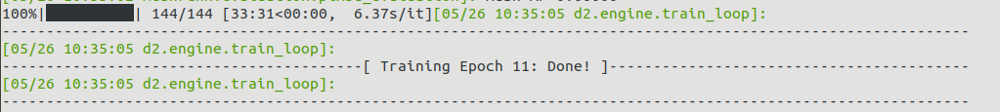

### What's New

* visdom plotter wrapped.

For people who prefer to use visdom to plot.
For me, I am using remote cluster for training the network. While there is no UI provided by the cluster and no outranet IP for use, I need to connect the remote cluster from one intra computation node and then connect the intra computation node by my personal computer, real-time training plot is so tricky. I found visdom is more feasible to solve this problem.

The modifications are generally located in
[detectron2/engine](detectron2/engine) and [detectron2/utils/visdom_plot.py](detectron2/utils/visdom_plot.py).

Specifically, you can modify your server IP in [detectron2/utils/visdom_plot.py](detectron2/utils/visdom_plot.py) on this line of code `self.viz = Visdom(server='http://10.141.1.179')`. Here `http://10.141.1.179` is my intra computation node IP, while I can access this visdom port by its outer IP `http://152.83.81.61:8097/`.

* training with epoch shown by tqdm.

By default, detectron2 only support max_iter training setup.
The modifications are generally located in [detectron2/engine/train_loop.py](detectron2/engine/train_loop.py) and [detectron2/engine/defaults.py](detectron2/engine/defaults.py)
